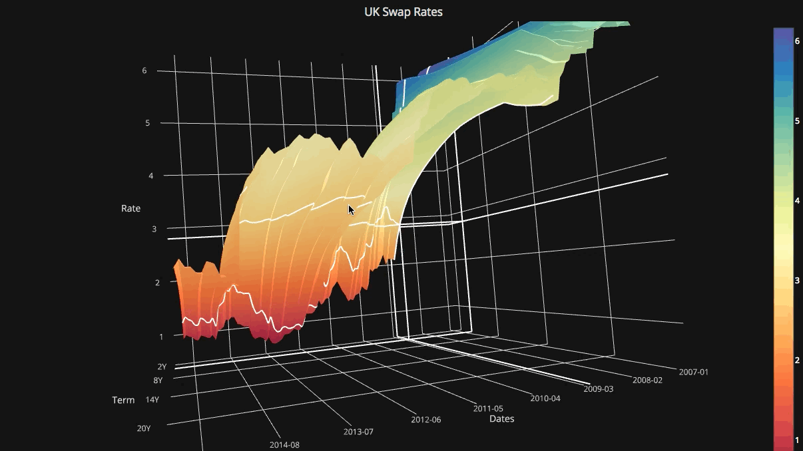
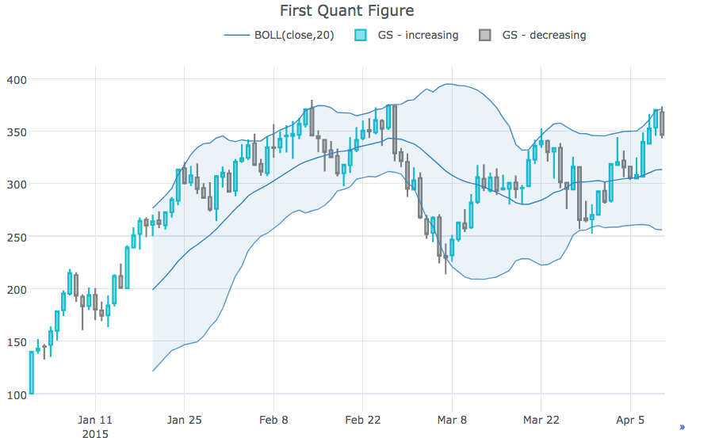
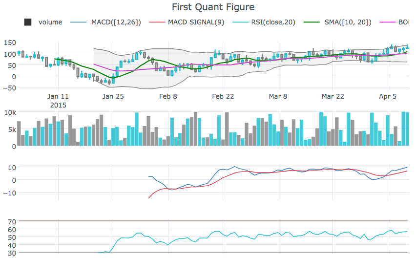

## Cufflinks

This library binds the power of [plotly](http://www.plot.ly) with the flexibility of [pandas](http://pandas.pydata.org/) for easy plotting.

This library is available on [https://github.com/santosjorge/cufflinks](https://github.com/santosjorge/cufflinks)

This tutorial assumes that the plotly user credentials have already been configured as stated on the [getting started](https://plot.ly/python/getting-started/) guide.

### Tutorials:

* [Chart Gallery](http://nbviewer.ipython.org/gist/santosjorge/b278ce0ae2448f47c31d)
* [Pandas Like Visualization](http://nbviewer.ipython.org/gist/santosjorge/aba934a0d20023a136c2)
* [The Basics](http://nbviewer.ipython.org/gist/santosjorge/f3b07b2be8094deea8c6)
* [Color Management](http://nbviewer.ipython.org/gist/santosjorge/00ca17b121fa2463e18b)
* [Offline Mode](http://nbviewer.ipython.org/gist/santosjorge/5fdbe947496faf7af5e6)



### Release Notes

### v0.17.0
Support for Plotly 4.x  
Cufflinks is no longer compatible with Plotly 3.x

### v0.14.0
Support for Plotly 3.0

### v0.13.0
New `iplot` helper. 
To see a comprehensive list of parameters 
**cf.help()**

```python
# For a list of supported figures
cf.help()
# Or to see the parameters supported that apply to a given figure try
cf.help('scatter')
cf.help('candle') #etc
```

### v0.12.0

Removed dependecies on ta-lib. 
This library is no longer required. 
All studies have be rewritten in Python. 

### v0.11.0

* `QuantFigure` is a new class that will generate a graph object with persistence. 
Parameters can be added/modified at any given point. 

This can be as easy as:

```python
df=cf.datagen.ohlc()
qf=cf.QuantFig(df,title='First Quant Figure',legend='top',name='GS')
qf.add_bollinger_bands()
qf.iplot()

```



* **Technical Analysis Studies** can be added on demand. 

```python
qf.add_sma([10,20],width=2,color=['green','lightgreen'],legendgroup=True)
qf.add_rsi(periods=20,color='java')
qf.add_bollinger_bands(periods=20,boll_std=2,colors=['magenta','grey'],fill=True)
qf.add_volume()
qf.add_macd()
qf.iplot()
```




### v0.10.0

* `rangeslider` to display a date range slider at the bottom
	* `cf.datagen.ohlc().iplot(kind='candle',rangeslider=True)`	
* `rangeselector` to display buttons to change the date range displayed
	* `cf.datagen.ohlc(500).iplot(kind='candle', rangeselector={ 'steps':['1y','2 months','5 weeks','ytd','2mtd','reset'], 
     'bgcolor' : ('grey',.3), 'x': 0.3 , 'y' : 0.95})`	
* Customise annotions, with `fontsize`,`fontcolor`,`textangle`
	* Label mode
		* `cf.datagen.lines(1,mode='stocks').iplot(kind='line',
					annotations={'2015-02-02':'Market Crash',
	                 		     '2015-03-01':'Recovery'},
	                textangle=-70,fontsize=13,fontcolor='grey')`
	* Explicit mode
		* `cf.datagen.lines(1,mode='stocks').iplot(kind='line',
				annotations=[{'text':'exactly here','x':'0.2',
				'xref':'paper','arrowhead':2,
				'textangle':-10,'ay':150,'arrowcolor':'red'}])`

### v0.9.0

* `Figure.iplot()` to plot figures
* New high performing **candle** and **ohlc** plots
	* `cf.datagen.ohlc().iplot(kind='candle')`	


### v0.8.0

* 'cf.datagen.choropleth()' to for sample choropleth data. 
* 'cf.datagen.scattergeo()' to for sample scattergeo data. 
* Support for choropleth and scattergeo figures in `iplot`
* 'cf.get_colorscale' for maps and plotly objects that support colorscales

### v0.7.1

* `xrange`, `yrange` and `zrange` can be specified in `iplot` and `getLayout`
	* `cf.datagen.lines(1).iplot(yrange=[5,15])`
* `layout_update` can be set in `iplot` and `getLayout` to explicitly update any `Layout` value

### v0.7

* Support for Python 3

### v0.6  
[See the IPython Notebook](http://nbviewer.ipython.org/gist/santosjorge/72665839a6f05a0567e0?flush_cache=true)

* Support for **pie** charts  
	* `cf.datagen.pie().iplot(kind='pie',labels='labels',values='values')`
* Generate Open, High, Low, Close data
	* `datagen.ohlc()`
* Candle Charts support
	* `ohlc=cf.datagen.ohlc()`  
	  `ohlc.iplot(kind='candle',up_color='blue',down_color='red')`
* OHLC (Bar) Charts support
	* `ohlc=cf.datagen.ohlc()`  
	  `ohlc.iplot(kind='ohlc',up_color='blue',down_color='red')`
* Support for logarithmic charts ( logx | logy )
	* `df=pd.DataFrame([x**2] for x in range(100))`  
	  `df.iplot(kind='lines',logy=True)`  
* Support for MulitIndex DataFrames
* Support for Error Bars ( error_x | error_y )
	* `cf.datagen.lines(1,5).iplot(kind='bar',error_y=[1,2,3.5,2,2])`  
	* `cf.datagen.lines(1,5).iplot(kind='bar',error_y=20, error_type='percent')`   
* Support for continuous error bars
	* `cf.datagen.lines(1).iplot(kind='lines',error_y=20,error_type='continuous_percent')`
	* `cf.datagen.lines(1).iplot(kind='lines',error_y=10,error_type='continuous',color='blue')`
* **Technical Analysis Studies for Timeseries** *(beta)*  
	* Simple Moving Averages (SMA)
		* `cf.datagen.lines(1,500).ta_plot(study='sma',periods=[13,21,55])` 
	* Relative Strength Indicator (RSI)
		* `cf.datagen.lines(1,200).ta_plot(study='boll',periods=14)`  
	* Bollinger Bands (BOLL)
		* `cf.datagen.lines(1,200).ta_plot(study='rsi',periods=14)`  
	* Moving Average Convergence Divergence (MACD)
		* `cf.datagen.lines(1,200).ta_plot(study='macd',fast_period=12,slow_period=26,
                                signal_period=9)`  


### v0.5

* Support of offline charts
	* `cf.go_offline()`
	* `cf.go_online()`
	* `cf.iplot(figure,online=True)` (To force online whilst on offline mode)
* Support for secondary axis
	* `fig=cf.datagen.lines(3,columns=['a','b','c']).figure()`  
	  `fig=fig.set_axis('b',side='right')`  
	  `cf.iplot(fig)`  


### v0.4

* Support for global theme setting
	* `cufflinks.set_config_file(theme='pearl')`
* New theme *ggplot*
	* `cufflinks.datagen.lines(5).iplot(theme='ggplot')`
* Support for horizontal bar charts *barh*
	* `cufflinks.datagen.lines(2).iplot(kind='barh',barmode='stack',bargap=.1)`
* Support for histogram orientation and normalization
	* `cufflinks.datagen.histogram().iplot(kind='histogram',orientation='h',norm='probability')`
* Support for *area* plots
	* `cufflinks.datagen.lines(4).iplot(kind='area',fill=True,opacity=1)`
* Support for *subplots*
	* `cufflinks.datagen.histogram(4).iplot(kind='histogram',subplots=True,bins=50)`
	* `cufflinks.datagen.lines(4).iplot(subplots=True,shape=(4,1),shared_xaxes=True,vertical_spacing=.02,fill=True)`
* Support for *scatter matrix* to display the distribution amongst every series in the DataFrame
	* `cufflinks.datagen.lines(4,1000).scatter_matrix()`
* Support for *vline* and *hline* for horizontal and vertical lines
	* `cufflinks.datagen.lines(3).iplot(hline=[2,3])`
	* `cufflinks.datagen.lines(3).iplot(hline=dict(y=2,color='blue',width=3))`
* Support for *vspan* and *hspan* for horizontal and vertical areas
	* `cufflinks.datagen.lines(3).iplot(hspan=(-1,2))`
	* `cufflinks.datagen.lines(3).iplot(hspan=dict(y0=-1,y1=2,color='orange',fill=True,opacity=.4))`


### v0.3.2

* Global setting for public charts
	* `cufflinks.set_config_file(world_readable=True)`

#### v0.3

* Enhanced Spread charts
	* `cufflinks.datagen.lines(2).iplot(kind='spread')`
* Support for Heatmap charts
	* `cufflinks.datagen.heatmap().iplot(kind='heatmap')`
* Support for Bubble charts
	* `cufflinks.datagen.bubble(4).iplot(kind='bubble',x='x',y='y',text='text',size='size',categories='categories')`
* Support for Bubble3d charts
	* `cufflinks.datagen.bubble3d(4).iplot(kind='bubble3d',x='x',y='y',z='z',text='text',size='size',categories='categories')`
* Support for Box charts
	* `cufflinks.datagen.box().iplot(kind='box')`
* Support for Surface charts
	* `cufflinks.datagen.surface().iplot(kind='surface')`
* Support for Scatter3d charts
	* `cufflinks.datagen.scatter3d().iplot(kind='scatter3d',x='x',y='y',z='z',text='text',categories='categories')`
* Support for Histograms
	* `cufflinks.datagen.histogram(2).iplot(kind='histogram')`
* Data generation for most common plot types
	* `cufflinks.datagen`
* Data extraction: Extract data from any Plotly chart. Data is delivered in DataFrame
	* `cufflinks.to_df(Figure)`
* Integration with [colorlover](https://github.com/jackparmer/colorlover/)
	* Support for scales `iplot(colorscale='accent')` to plot a chart using an *accent* color scale
	* cufflinks.scales() to see all available scales
* Support for named colors
		* `iplot(colors=['pink','red','yellow'])`

